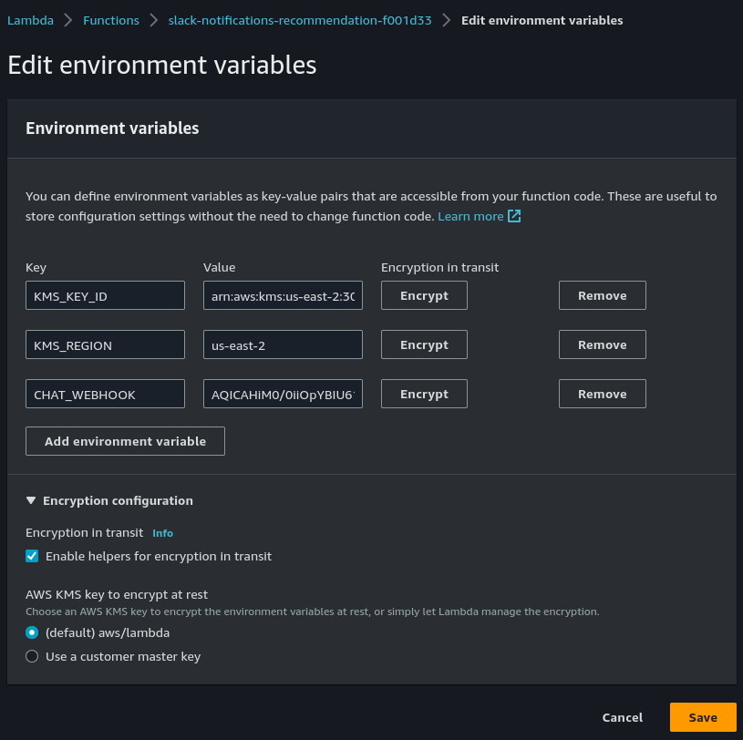

Role
----

This component forces the creation of the role inside the `/lambda` path, thus allowing:

- Better restriction on the privileges of the IAM Role used to deploy the stack
- Better control on resource-based policies, SCP and other types of policies

This component is a factory above the `iam.Role` component and beyond the path, it add:

- Trust relationship to the lambda.amazonaws.com service
- Permissions to write logs to CloudWatch

```typescript
import { lambda } from '@soufantech/pulumi-aws-contrib';

const name = 'main-api';

const { role } = lambda.createLambdaRole(name, {
    name,
    maxSessionDuration: 3600,
});
```

Function
--------

### AbstractFunction

This component abstracts the creation of the following components:

- Lambda Function
- CloudWatch Log Group
- IAM Role

It is possible to pass parameters to each of the components mentioned.

This is an abstract class and must be extended by others, and its methods can be changed (i.e. Template Method):

- constructor
- prepareIamRoleArgs
- createIamRole
- prepareLambdaFunctionArgs
- createLambdaFunction
- prepareLogGroupArgs
- createLogGroup

### SimpleFunction

This class implements the basic behavior of AbstractFunction.

### EncryptedFunction

This class adds the possibility to pass environment variables that will be encrypted, similar to the native behavior of AWS Lambda Function shown below:



To instantiate this class it is necessary to specify a KMS key, with this it is possible to reuse the key to encrypt other lambdas.
