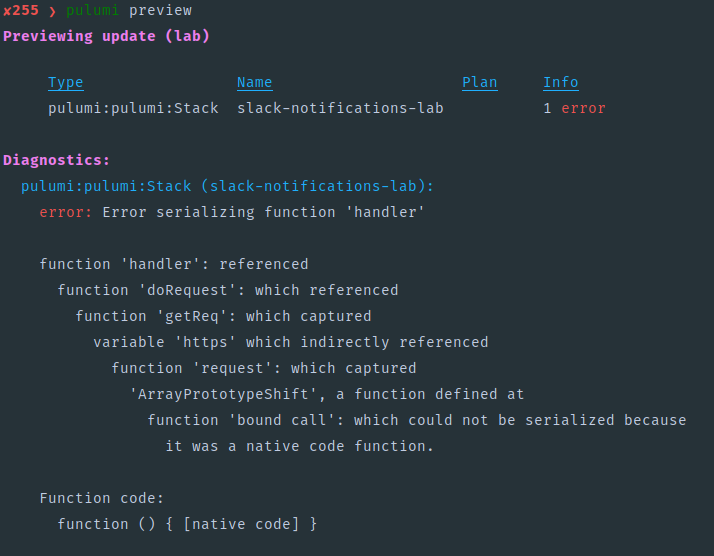

How to use
----------

```javascript
import { SlackNotificationFunction } from '@soufantech/pulumi-contrib';

// ...

const webhook = config.requireSecret('webhook');
const notificationFunction = new SlackNotificationFunction('slack-notifications', {
  region,
  accountId,
  slackWebhook: webhook,
});

export const lambdaFunctionArn = notificationFunction.lambdaFunction.arn;
export const snsTopicArn = notificationFunction.snsTopic.arn;
```

How to contribute
-----------------

### How change lambda function

```shell
cd function
yarn install
# edit file in src/ directory
yarn build
git add .  # include dist/ directory
git commit -m "message here"
```

- Motivation: lambda function runtimes don't have the latest version of aws-sdk
- This flow uses webpack and makes it possible to add future external packages
- Reference: https://maxsmolens.org/posts/bundling-an-aws-lambda-function-using-webpack/
- Alternative using lambda layer: https://aws.amazon.com/pt/premiumsupport/knowledge-center/lambda-layer-aws-sdk-latest-version/

### How to test

How to test projects using this component.

#### Lambda tests

Run command bellow (change JSON file):

```shell
aws lambda invoke \
  --function-name "$(pulumi stack output lambdaFunctionArn)" \
  --log-type "Tail" \
  --payload "file://lambda-tests/alarm.json" \
  --cli-binary-format raw-in-base64-out \
  --query "LogResult" --output text \
  result.log | base64 -d
```

*More JSON test files in `./lamda-tests` directory.*

#### SNS tests

Run command bellow (change JSON file):

```shell
aws sns publish \
  --topic-arn "$(pulumi stack output snsTopicArn)" \
  --message "file://sns-tests/alarm.json"
```

*More JSON test files in `./sns-tests` directory.*

Problems
--------

### Why not use aws.lambda.CallbackFunction



Reference: https://github.com/pulumi/pulumi/issues/5294
